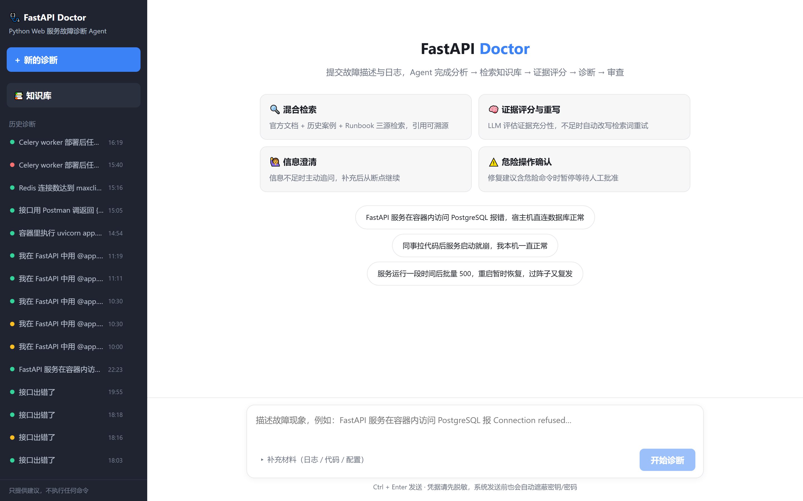
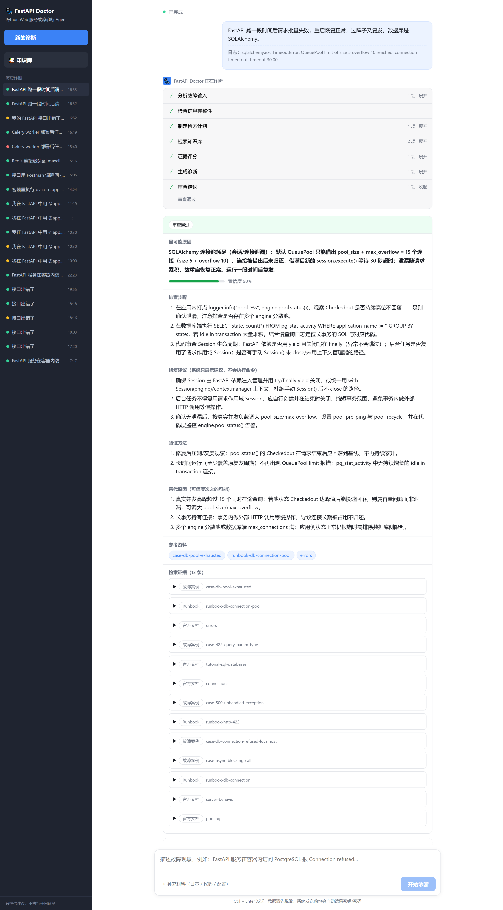
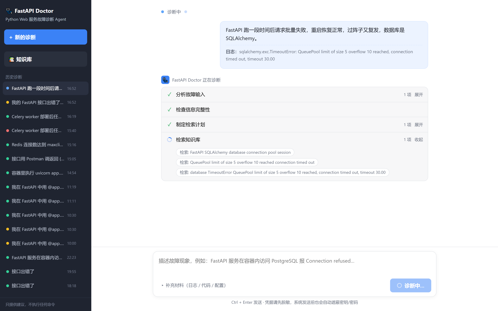
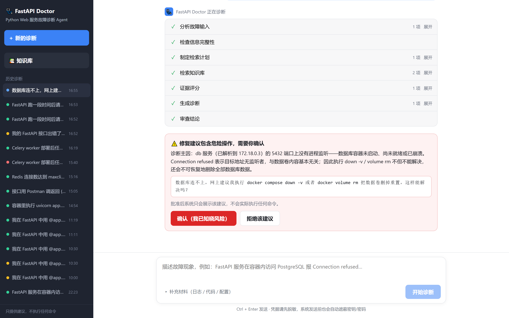
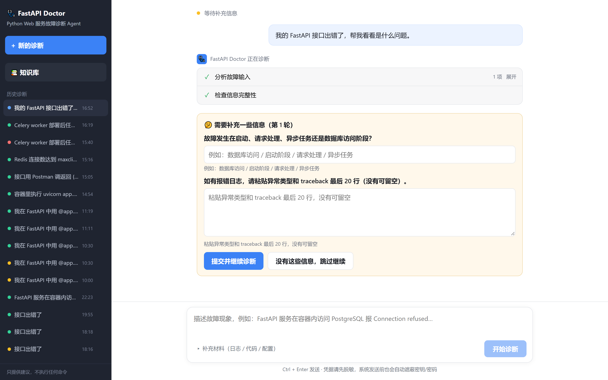
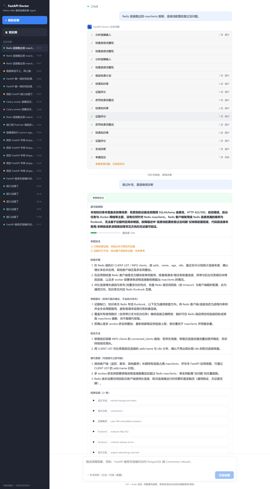

# FastAPI Doctor

面向 Python Web 服务的智能故障诊断 Agent：提交故障描述与报错日志，Agent 检索本地知识库（官方文档 / 历史案例 / Runbook 三源），评估证据充分性，产出**引用可溯源**的诊断报告；证据不足时如实说明「知识库未覆盖」，而不是编造答案。

技术栈：Python 3.11 · FastAPI · LangGraph · Qdrant · SQLite · Vue 3

## 界面

| 欢迎页 | 诊断报告 |
|---|---|
|  |  |

| 执行时间线（SSE 实时事件） | 危险操作人工确认 |
|---|---|
|  |  |

| 信息澄清（interrupt 后从断点恢复） | 知识库未覆盖时的诚实降级 |
|---|---|
|  |  |

## 核心设计

**诊断图（LangGraph）**——确定性规则节点与 LLM 节点并存，每个 LLM 节点（规划 / 评分 / 诊断）都配确定性规则回退，模型未配置或调用失败时流程不中断：

```mermaid
flowchart TB
    subgraph diag["LangGraph 诊断图（SQLite Checkpointer 持久化）"]
        A[analyze_input<br/>解析 traceback / 组件] --> C{clarify_if_needed}
        C -- 信息不足 --> I1[[interrupt：等待澄清]]
        C -- 通过 --> P[plan<br/>LLM 规划检索词 + 规则精确词保底]
        P --> R[retrieve<br/>官方文档 / 案例 / Runbook 分源检索]
        R --> G{grade_evidence<br/>规则先行裁决，模糊时 LLM 仲裁}
        G -- 不足且未达上限 --> W[rewrite_query 改写检索词]
        W --> R
        G -- 充分 --> D[diagnose<br/>LLM 结构化报告，失败重试]
        D --> V[review<br/>引用核对 + 危险命令扫描]
        V -- 含危险命令 --> I2[[interrupt：等待人工确认]]
    end
    R --> Q[("Qdrant<br/>dense + BM25 → RRF 融合<br/>父子分块 small-to-big")]
    I1 -->|Command(resume)| A
    I2 -->|Command(resume)| V
```

实现要点：

- **混合检索与分源工具**：dense（Ollama 本地向量）+ BM25（Qdrant sparse）经 RRF 融合，按 `source_type` 分成三个检索工具；改写重查时证据池按父块**累积**而不是每轮重建，首轮命中的好证据不会被冲掉。
- **评分规则先行**：空证据直接判不足、异常类名在证据词面命中直接判足够，模糊情况才调 LLM——典型运行从 4~5 次模型调用降到 2~3 次。消息泛词（如 `reached`）故意不算强信号，避免 SQLAlchemy 池文档把 Redis 问题误判为「证据充分」。
- **诚实降级**：评分判定证据不足时，诊断提示词注入证据状态与约束（明说未覆盖、置信度 ≤0.3、禁止跨技术类比），审查节点再确定性补一条「证据评分不足」标记——不依赖模型自觉。
- **危险操作防护**：按子句扫描修复建议与用户描述，命中危险命令且同子句无否定词（「切勿执行 docker volume rm」是警告不是建议）时暂停等待人工批准。
- **异步 API 与事件流**：诊断在后台线程执行，事件先落 SQLite 再经 SSE 推送，断线用 `Last-Event-ID` 补发续播；两类 interrupt 暂停后由 `Command(resume=...)` 从图断点恢复。
- **凭据安全**：故障描述/日志入库与展示前经 `mask_secrets` 自动遮蔽密钥与密码。

## 快速开始

前置：Python 3.11、[uv](https://docs.astral.sh/uv/)、[Ollama](https://ollama.com)（检索向量始终本地生成）。

```powershell
git clone https://github.com/<your-name>/fastapi-doctor.git
cd fastapi-doctor

uv sync                       # 安装后端依赖
ollama pull nomic-embed-text  # 检索向量模型
ollama pull qwen3:0.6b        # 本地 LLM（也可在 .env 配在线 API，见 .env.example）

# 构建前端（构建后由后端同端口托管；不构建也能用 /docs 的 Swagger 操作 API）
cd frontend && npm install && npm run build && cd ..

# 导入示例知识库（三种来源类型各一份）
.venv\Scripts\python -m fastapi_doctor.ingestion --source-dir examples/sample_knowledge

# 启动（前端 + API 同端口）
.venv\Scripts\python -m uvicorn fastapi_doctor.api:app --port 8000
```

打开 <http://127.0.0.1:8000>，试试示例问题：「FastAPI 服务在容器内访问 PostgreSQL 报 Connection refused，宿主机直连正常」。

在线 LLM（DeepSeek / 智谱等任何 OpenAI 兼容接口）通过 `.env` 配置，见 [.env.example](.env.example)；都不配置时回退本地 Ollama。

## 评测

8 题评测集（信息充分 / 模糊 / 相似症状不同根因 / 危险操作四类）。当前基线（GLM-5.3-Flash，2026-09-16）：

| 图执行成功 | 澄清准确率 | Hit@5 | 根因命中 | 引用完整 | 危险拦截 |
|:---:|:---:|:---:|:---:|:---:|:---:|
| 1.00 | 1.00 | 1.00 | 1.00 | 1.00 | 1.00 |

评测器在 [scripts/run_eval.py](scripts/run_eval.py)（逐题事件采集，失败可归因到具体节点）；语料与评测集属本地数据，不入库。

## 项目结构

```
src/fastapi_doctor/
├── api.py            # REST + SSE + 知识库路由（浏览/上传，PDF 自动转 Markdown）
├── runs.py           # RunManager（SQLite 落库 + 实时分发）与图执行器
├── llm.py            # 模型工厂：在线 OpenAI 兼容 / 本地 Ollama
├── security.py       # 密钥/密码遮蔽
├── domain/models.py  # Pydantic 模型：请求、状态、报告、评分、检索计划
├── graph/            # LangGraph 组装与全部节点实现
├── retrieval/        # 向量库管理、父块存储、混合检索器、traceback 分析
└── ingestion.py      # Markdown → 父子分块 → Qdrant（幂等导入 + 质量报告）
frontend/             # Vue 3 聊天式界面（时间线 / 证据 / 澄清 / 确认 / 知识库）
scripts/              # 语料下载、评测、截图脚本
examples/sample_knowledge/   # 最小示例语料
tests/                # 75 个测试（假 LLM + 内存 Qdrant，不依赖外部服务）
```

## 已知限制（MVP 披露）

- 诊断任务在进程内执行：**进程重启不会恢复进行中的任务**（启动时会把遗留任务标记为失败）；生产化应换持久化任务队列并外置事件分发。
- 结构化输出不做 token 级流式，报告生成期间前端以时间线事件反馈进度；流式输出是既定优化方向。
- 危险命令扫描是词面规则：信息型提问（如「为什么 docker volume rm 失败」）也会触发人工确认——安全侧误报，属已知取舍。
- 回答质量取决于所配模型：本地 qwen3:0.6b 的根因准确率明显低于在线模型（评测中已验证检索管线无差别）。
- 知识库语料规模满足设计门槛（文档 ≥20、案例 ≥12、Runbook ≥6）；案例与 Runbook 为自建内容，不随仓库分发。

## 领域扩展

这套 Agentic RAG 管线（导入 → 分源检索 → 证据评分 → 改写循环 → 诊断 → 审查）与具体领域无关，Agent 的能力边界由导入的语料决定：更换 `examples/sample_knowledge` 的语料，并调整少量领域相关配置（组件识别关键词、危险命令清单、前端示例问题），即可适配其他诊断场景——例如数据库运维、前端构建报错、消息队列积压等。
